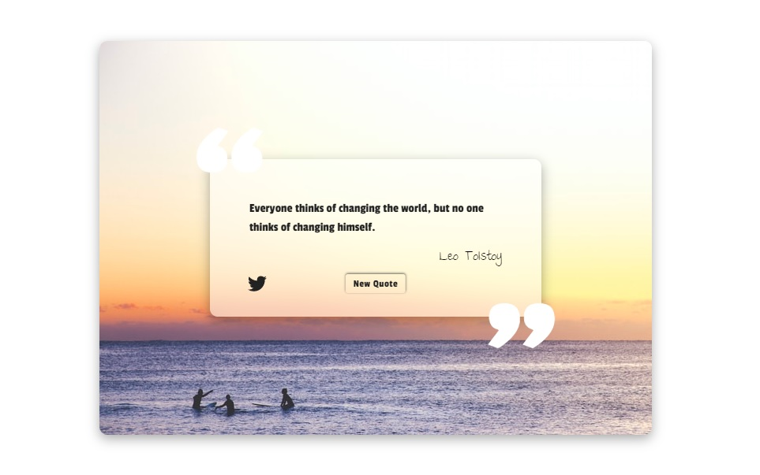
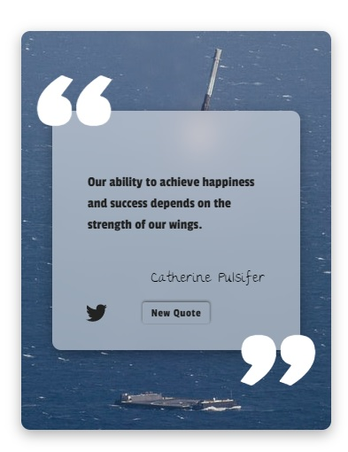

### freeCodeCamp: Front End Development Libraries
# Project 1: [Build a Random Quote Machine](https://www.freecodecamp.org/learn/front-end-development-libraries/front-end-development-libraries-projects/build-a-random-quote-machine)

## Table of contents

- [Overview](#overview)
  - [The challenge](#the-challenge)
  - [Screenshot](#screenshot)
  - [Links](#links)
- [My process](#my-process)
  - [Built with](#built-with)
  - [What I learned](#what-i-learned)
  - [Continued development](#continued-development)
  - [Useful resources](#useful-resources)
- [Author](#author)
- [Acknowledgments](#acknowledgments)

## Overview

### The challenge

Fulfill the user stories and get all of the tests to pass. Use whichever libraries or APIs you need.

### Screenshot

| Desktop layout |
|:--:|

| Mobile layout |
|:--:|

### Links

- Solution URL: https://github.com/PavlinaPs/random-quote-machine
- Live Site URL: https://pavlinaps.github.io/random-quote-machine/

## My process

### Built with

- Semantic HTML5 markup
- CSS custom properties
- Flexbox
- jQuery

### What I learned

This is my first time using jQuery and API. I learned a lot.

### Continued development

 I am aware, that my project is not very good performance-wise, unfortunately as of now I don't know, how to optimize it. I'm also not sure if I'm supposed to use AJAX with jQuery or I could use async await and cry-catch syntax as I did.

### Useful resources

[Tips For Using Async/Await in JavaScript](https://youtu.be/_9vgd9XKlDQ) James Q Quick on YouTube

## Author

- GitHub - [PavlinaPs](https://github.com/PavlinaPs)
- freeCodeCamp - [@pavlina1](https://www.freecodecamp.org/pavlina1)

## Acknowledgments

It is great that I learn to code with freeCodeCamp. It is very useful for me. You are the best. Thank you!

